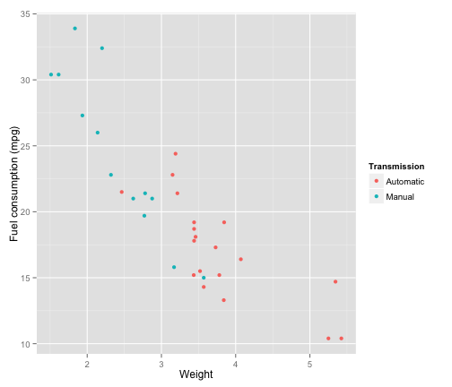
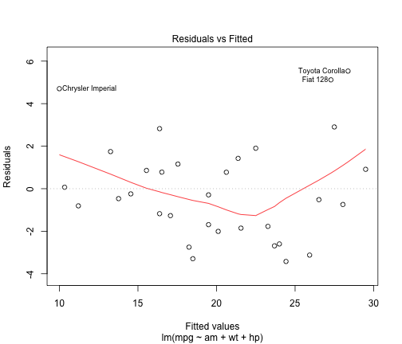

---
output:
    pdf_document:
---

Fuel vs. transmission: weight matters!
======================================

Summary
-------

We investigate the relationship between fuel consumption and transmission type of cars in the mtcars dataset using multilinear regression. While naively fuel consumption and transmission seem to be linked, this connection is not statistically significant once one takes the confounders weight and horsepower into account.

Data Preprocessing and Exploration
----------------------------------

We use data from the mtcars data set native to R. This data set describes fuel consumption and various other aspects of automobile design for 32 car models from 1973 and 1974. Our data preprocessing is limited to providing more descriptive names for the am variable, which denotes transmission type, and to converting it into a factor variable, stored in the mymtcars data frame.


To obtain some intuition about the data in question, we perform an exploratory plot of fuel consumption as it depends on car weight for different transmission types.


```r
library(ggplot2)
ggplot(mymtcars, aes(x = wt, y = mpg, color = am)) + geom_point() + labs(color = "Transmission", 
    x = "Weight", y = "Fuel consumption (mpg)")
```

 


From this plot, one can make two observations:

* Manual transmissions seem to be associated with less fuel consumption compared to automatic ones, i.e. they have higher values of the mpg variable, which denotes miles driven per gallon of fuel consumed.
* This relationship however seems to be largely caused by the fact that manual transmissions are mostly used in lighter cars.

We will confirm both of these observations using multilinear regression, and also see that horsepower is another relevant confounder in the relationship in question.

Regression Analysis
-------------------

The simplest linear model one can think of to make a statement about this would be a linear model relating just fuel consumption and transmission type:


```r
fit1 <- lm(mpg ~ am, mymtcars)
summary(fit1)$coefficients[2, ]
```

```
##   Estimate Std. Error    t value   Pr(>|t|) 
##   7.244939   1.764422   4.106127   0.000285
```


From this oversimplified model, one would naively infer from the regression coefficient that manual transmissions are linked to a better fuel consumption (in that one can drive about 7.2 additional miles per gallon of fuel if one drives a car with manual instead of automatic transmission), and that the relationship would be statistically significant, at a p-value of .00028.

This regression does not take possible confounders into account. Indeed, including weight and horsepower of the cars in the dataset into the multilinear model yields significant changes.


```r
fit2 <- lm(mpg ~ am + wt, mymtcars)
fit3 <- lm(mpg ~ am + wt + hp, mymtcars)
anova(fit1, fit2, fit3)$"Pr(>F)"[-1]
```

```
## [1] 5.071e-09 5.464e-04
```


Note that both including weight (in fit2) and horsepower (in fit3) provides a significant improvement, with p-values of $5 \times 10^{-9}$ and $5 \times 10^{-4}$ respectively in their likelihood ratio tests compared to models not including them. Including more variables, however, does not significantly improve our model any further, since all associated p-values are larger than 5% (other factors have been considered as well, though not shown explicitly):


```r
fit4 <- lm(mpg ~ am + wt + hp + factor(cyl), mymtcars)
fit5 <- lm(mpg ~ am + wt + hp + disp, mymtcars)

cbind(anova(fit3, fit4)$"Pr(>F)"[-1], anova(fit3, fit5)$"Pr(>F)"[-1])
```

```
##      [,1]   [,2]
## [1,]  0.1 0.8122
```


The multilinear regression that includes weight and horsepower as confounders however does __not__ show any significant relation between fuel consumption and transmission type anymore, with an associated p-value of about .14!


```r
summary(fit3)$coefficients[2, ]
```

```
##   Estimate Std. Error    t value   Pr(>|t|) 
##     2.0837     1.3764     1.5139     0.1413
```


Finally, one can check the residuals distribution of this model:


```r
plot(fit3, which = 1)
```

 


There are no drastic outliers to the regression curve, and the minor outliers are slightly, but not excessively more influential than the typical data point, as one can see by comparing their hat values --- 0.1065, 0.2303, 0.1113, respectively --- to the mean hat value of 0.125 of the fit.
